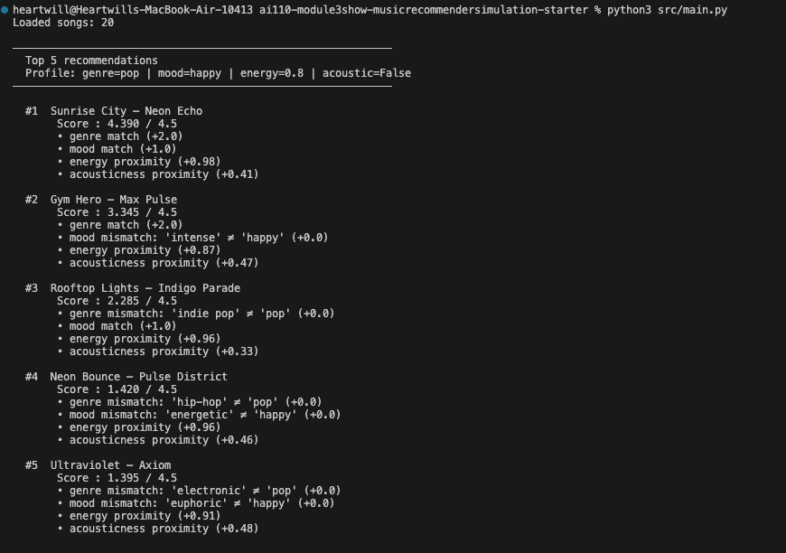

# 🎵 Music Recommender Simulation

## Project Summary

This project builds a content-based music recommender simulation in Python.
It scores each song in a 20-song catalog against a user taste profile using
a point-based recipe, then returns the top-K ranked matches with plain-language
explanations.

The system uses four features per song — genre, mood, energy, and acousticness —
weighted so that genre and mood matches earn binary bonuses while energy and
acousticness proximity earn graduated partial credit. The result is a transparent,
explainable recommender that mirrors the content-based layer used inside real
platforms like Spotify's Daily Mix.

---

## How The System Works

### Song Features

Each song in `data/songs.csv` carries ten attributes. The recommender uses four
of them directly in scoring:

| Feature | Type | Role in scoring |
|---|---|---|
| `genre` | string | Binary match — the single heaviest signal |
| `mood` | string | Binary match — second heaviest signal |
| `energy` | float 0–1 | Proximity score — rewards closeness to user target |
| `acousticness` | float 0–1 | Proximity score — rewards texture preference match |

The remaining columns (`tempo_bpm`, `valence`, `danceability`) are stored but
not yet weighted. They represent room for future improvement.

### User Profile

The taste profile is a Python dictionary with four keys:

```python
user_prefs = {
    "genre":          "lofi",     # preferred genre label
    "mood":           "chill",    # preferred mood label
    "energy":         0.38,       # target energy level (0.0 = very calm, 1.0 = very intense)
    "likes_acoustic": True,       # True = rewards high acousticness, False = rewards low
}
```

### Algorithm Recipe

The recommender uses a two-step process — a **Scoring Rule** and a **Ranking Rule**.

#### Scoring Rule — `score_song(user_prefs, song)`

Every song is scored independently against the user profile. Points are additive;
maximum possible score is **4.5**.

```
+2.0   genre match        binary: full points if song.genre == user.genre
+1.0   mood match         binary: full points if song.mood  == user.mood
+1.0   energy proximity   (1 − |song.energy − user.energy|) × 1.0
+0.5   acoustic proximity (1 − |song.acousticness − target_ac|) × 0.5
                          where target_ac = 1.0 if likes_acoustic else 0.0
──────
 4.5   maximum
```

The proximity formula rewards songs that are *close* to the user's target rather
than simply above or below a threshold. A song at energy 0.70 still earns partial
credit toward a target of 0.38 — it is not zeroed out.

#### Ranking Rule — `recommend_songs(user_prefs, songs, k=5)`

```
1. Call score_song() for every song in the catalog
2. Sort all (song, score, explanation) results by score, highest first
3. Return the top k results
```

The Scoring Rule and Ranking Rule are kept as separate functions so that
explaining a single recommendation (`score_song` alone) and producing a full
ranked list (`recommend_songs`) can be done independently.

#### Example Output



See [docs/recommendation_flow.md](docs/recommendation_flow.md) for a full
Mermaid.js flowchart of the data flow from CSV to ranked output.

### Potential Biases

**Genre over-dominates the score.**
A genre match awards 2.0 out of 4.5 possible points — 44% of the maximum.
This means any non-lofi song is permanently capped at 2.5 pts no matter how
perfectly it matches on mood, energy, and acousticness. A jazz song at identical
energy and acousticness to the user target will always rank below a lofi song with
a mediocre energy match. Real listeners who enjoy chill jazz as much as chill lofi
would find this unfair.

**Mood is an exact string match.**
`"relaxed"` and `"chill"` are treated as completely different even though most
listeners experience them as nearly identical. Coffee Shop Stories (jazz, relaxed)
loses the full 1.0 mood bonus despite being exactly the kind of song a chill-lofi
fan typically enjoys.

**Valence and tempo are invisible.**
A slow, dark blues track (low valence, low BPM) and an upbeat acoustic folk song
can score identically because the system has no way to distinguish emotional
brightness. A user who asks for "chill" music likely wants moderate-to-positive
valence — but the system cannot enforce that.

**The catalog reflects one cultural perspective.**
The 20-song dataset was generated to cover common Western genres. Genres like
Afrobeats, cumbia, or classical Indian music are absent. A recommender trained or
evaluated on this catalog would implicitly treat those listening tastes as
out-of-scope.

---

## Getting Started

### Setup

1. Create a virtual environment (optional but recommended):

   ```bash
   python -m venv .venv
   source .venv/bin/activate      # Mac or Linux
   .venv\Scripts\activate         # Windows

2. Install dependencies

```bash
pip install -r requirements.txt
```

3. Run the app:

```bash
python -m src.main
```

### Running Tests

Run the starter tests with:

```bash
pytest
```

You can add more tests in `tests/test_recommender.py`.

---

## Experiments You Tried

Use this section to document the experiments you ran. For example:

- What happened when you changed the weight on genre from 2.0 to 0.5
- What happened when you added tempo or valence to the score
- How did your system behave for different types of users

---

## Limitations and Risks

Summarize some limitations of your recommender.

Examples:

- It only works on a tiny catalog
- It does not understand lyrics or language
- It might over favor one genre or mood

You will go deeper on this in your model card.

---

## Reflection

Read and complete `model_card.md`:

[**Model Card**](model_card.md)

Write 1 to 2 paragraphs here about what you learned:

- about how recommenders turn data into predictions
- about where bias or unfairness could show up in systems like this


---

## 7. `model_card_template.md`

Combines reflection and model card framing from the Module 3 guidance. :contentReference[oaicite:2]{index=2}  

```markdown
# 🎧 Model Card - Music Recommender Simulation

## 1. Model Name

Give your recommender a name, for example:

> VibeFinder 1.0

---

## 2. Intended Use

- What is this system trying to do
- Who is it for

Example:

> This model suggests 3 to 5 songs from a small catalog based on a user's preferred genre, mood, and energy level. It is for classroom exploration only, not for real users.

---

## 3. How It Works (Short Explanation)

Describe your scoring logic in plain language.

- What features of each song does it consider
- What information about the user does it use
- How does it turn those into a number

Try to avoid code in this section, treat it like an explanation to a non programmer.

---

## 4. Data

Describe your dataset.

- How many songs are in `data/songs.csv`
- Did you add or remove any songs
- What kinds of genres or moods are represented
- Whose taste does this data mostly reflect

---

## 5. Strengths

Where does your recommender work well

You can think about:
- Situations where the top results "felt right"
- Particular user profiles it served well
- Simplicity or transparency benefits

---

## 6. Limitations and Bias

Where does your recommender struggle

Some prompts:
- Does it ignore some genres or moods
- Does it treat all users as if they have the same taste shape
- Is it biased toward high energy or one genre by default
- How could this be unfair if used in a real product

---

## 7. Evaluation

How did you check your system

Examples:
- You tried multiple user profiles and wrote down whether the results matched your expectations
- You compared your simulation to what a real app like Spotify or YouTube tends to recommend
- You wrote tests for your scoring logic

You do not need a numeric metric, but if you used one, explain what it measures.

---

## 8. Future Work

If you had more time, how would you improve this recommender

Examples:

- Add support for multiple users and "group vibe" recommendations
- Balance diversity of songs instead of always picking the closest match
- Use more features, like tempo ranges or lyric themes

---

## 9. Personal Reflection

A few sentences about what you learned:

- What surprised you about how your system behaved
- How did building this change how you think about real music recommenders
- Where do you think human judgment still matters, even if the model seems "smart"

