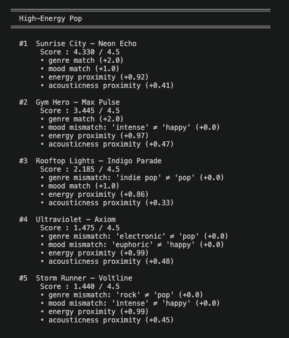
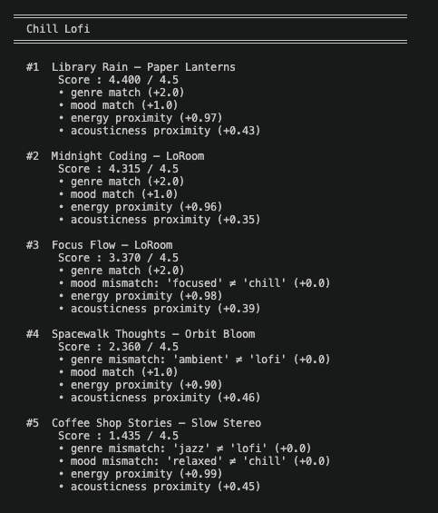
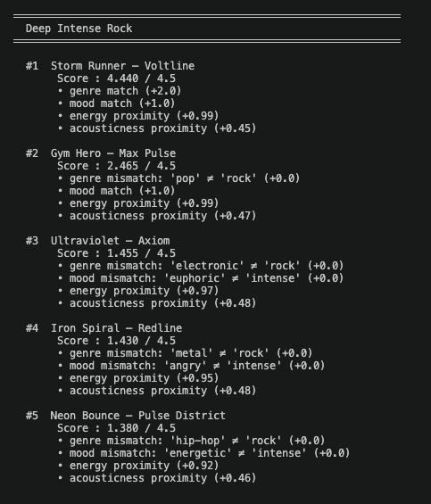
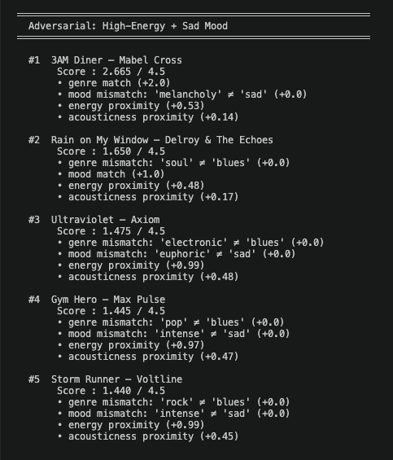
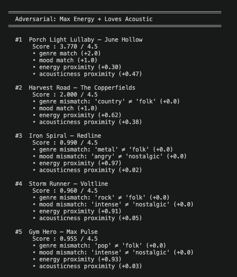

# 🎵 Music Recommender Simulation

## Project Summary

This project builds a content-based music recommender simulation in Python.
It scores each song in a 20-song catalog against a user taste profile using
a point-based recipe, then returns the top-K ranked matches with plain-language
explanations.

The system uses four features per song — genre, mood, energy, and acousticness —
weighted so that genre and mood matches earn binary bonuses while energy and
acousticness proximity earn graduated partial credit. The result is a transparent,
explainable recommender that mirrors the content-based layer used inside real
platforms like Spotify's Daily Mix.

---

## How The System Works

### Song Features

Each song in `data/songs.csv` carries ten attributes. The recommender uses four
of them directly in scoring:

| Feature | Type | Role in scoring |
|---|---|---|
| `genre` | string | Binary match — the single heaviest signal |
| `mood` | string | Binary match — second heaviest signal |
| `energy` | float 0–1 | Proximity score — rewards closeness to user target |
| `acousticness` | float 0–1 | Proximity score — rewards texture preference match |

The remaining columns (`tempo_bpm`, `valence`, `danceability`) are stored but
not yet weighted. They represent room for future improvement.

### User Profile

The taste profile is a Python dictionary with four keys:

```python
user_prefs = {
    "genre":          "lofi",     # preferred genre label
    "mood":           "chill",    # preferred mood label
    "energy":         0.38,       # target energy level (0.0 = very calm, 1.0 = very intense)
    "likes_acoustic": True,       # True = rewards high acousticness, False = rewards low
}
```

### Algorithm Recipe

The recommender uses a two-step process — a **Scoring Rule** and a **Ranking Rule**.

#### Scoring Rule — `score_song(user_prefs, song)`

Every song is scored independently against the user profile. Points are additive;
maximum possible score is **4.5**.

```
+2.0   genre match        binary: full points if song.genre == user.genre
+1.0   mood match         binary: full points if song.mood  == user.mood
+1.0   energy proximity   (1 − |song.energy − user.energy|) × 1.0
+0.5   acoustic proximity (1 − |song.acousticness − target_ac|) × 0.5
                          where target_ac = 1.0 if likes_acoustic else 0.0
──────
 4.5   maximum
```

The proximity formula rewards songs that are *close* to the user's target rather
than simply above or below a threshold. A song at energy 0.70 still earns partial
credit toward a target of 0.38 — it is not zeroed out.

#### Ranking Rule — `recommend_songs(user_prefs, songs, k=5)`

```
1. Call score_song() for every song in the catalog
2. Sort all (song, score, explanation) results by score, highest first
3. Return the top k results
```

The Scoring Rule and Ranking Rule are kept as separate functions so that
explaining a single recommendation (`score_song` alone) and producing a full
ranked list (`recommend_songs`) can be done independently.

#### Example Output

**High-Energy Pop**


**Chill Lofi**


**Deep Intense Rock**


**Adversarial: High-Energy + Sad Mood**


**Adversarial: Max Energy + Loves Acoustic**


See [docs/recommendation_flow.md](docs/recommendation_flow.md) for a full
Mermaid.js flowchart of the data flow from CSV to ranked output.

### Potential Biases

**Genre over-dominates the score.**
A genre match awards 2.0 out of 4.5 possible points — 44% of the maximum.
This means any non-lofi song is permanently capped at 2.5 pts no matter how
perfectly it matches on mood, energy, and acousticness. A jazz song at identical
energy and acousticness to the user target will always rank below a lofi song with
a mediocre energy match. Real listeners who enjoy chill jazz as much as chill lofi
would find this unfair.

**Mood is an exact string match.**
`"relaxed"` and `"chill"` are treated as completely different even though most
listeners experience them as nearly identical. Coffee Shop Stories (jazz, relaxed)
loses the full 1.0 mood bonus despite being exactly the kind of song a chill-lofi
fan typically enjoys.

**Valence and tempo are invisible.**
A slow, dark blues track (low valence, low BPM) and an upbeat acoustic folk song
can score identically because the system has no way to distinguish emotional
brightness. A user who asks for "chill" music likely wants moderate-to-positive
valence — but the system cannot enforce that.

**The catalog reflects one cultural perspective.**
The 20-song dataset was generated to cover common Western genres. Genres like
Afrobeats, cumbia, or classical Indian music are absent. A recommender trained or
evaluated on this catalog would implicitly treat those listening tastes as
out-of-scope.

---

## Getting Started

### Setup

1. Create a virtual environment (optional but recommended):

   ```bash
   python -m venv .venv
   source .venv/bin/activate      # Mac or Linux
   .venv\Scripts\activate         # Windows

2. Install dependencies

```bash
pip install -r requirements.txt
```

3. Run the app:

```bash
python -m src.main
```

### Running Tests

Run the starter tests with:

```bash
pytest
```

You can add more tests in `tests/test_recommender.py`.

---

## Experiments I Tried

**Weight shift — halving genre, doubling energy:**
I changed the genre weight from 2.0 to 1.0 and raised the energy max from 1.0 to 2.0, keeping the total ceiling at 4.5.
The #1 result stayed the same for every standard profile, but spots 3–5 shifted toward songs from nearby genres that were energetically close.
For the Chill Lofi profile, Spacewalk Thoughts (ambient) jumped from 2.36 to 3.26 — a result that felt more musically honest.
This showed me that my original genre weight was burying valid recommendations.

**Adversarial profiles:**
I tested a "High-Energy + Sad Mood" profile to see what happens when preferences conflict.
The system couldn't resolve the contradiction — it just averaged the points.
The genre bonus decided #1, and high-energy songs with no mood match filled the rest of the list.
I also tested "Max Energy + Loves Acoustic," which revealed that acoustic and high-energy preferences fight each other since acoustic songs almost always have low energy.

---

## Limitations and Risks

- I only have 20 songs, so several genres have just one representative. A blues listener gets one good result and then a pile of mismatches.
- I don't use valence or tempo, so I can't tell the difference between a dark blues ballad and a bright folk song even if their energy levels are identical.
- The genre weight (2.0 pts) is so heavy that songs outside the user's genre almost never break into the top 5, even when they're a better fit on every other dimension.
- Mood and genre use exact string matching, so "relaxed" and "chill" score as completely different even though most listeners hear them the same way.
- My dataset only covers Western popular music, so the system would be useless for listeners whose taste falls outside that frame.

See [model_card.md](model_card.md) for the full analysis.

---

## Reflection

[**Full Model Card → model_card.md**](model_card.md)

I learned that a recommender system is really just a set of priorities disguised as math.
When I assigned 2.0 points to genre, I was saying "genre matters twice as much as anything else" — and the output reflected exactly that, for better and worse.
The system felt smart when the profile was clean and consistent (Chill Lofi, Deep Intense Rock) and fell apart as soon as the preferences contradicted each other.

The biggest surprise was how quickly the "intelligence" of the output disappears at the edges.
Inside its comfort zone, the algorithm feels like it understands music.
But the adversarial profiles made clear that it's just adding numbers — it has no concept of what "sad but high-energy" actually means to a listener.
That gap between looking smart and being smart is something I'll think about every time I use a recommendation feature in a real app.
