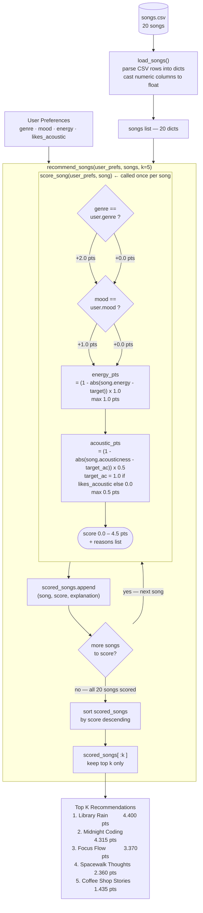

# Music Recommender — Data Flow

Traces the path from raw inputs to ranked output, showing exactly how
a single song moves through the system.

---

## Score Breakdown — What Each Component Contributes

| Component | Rule | Max pts | Source in `score_song()` |
|---|---|---|---|
| Genre match | binary — full or nothing | **2.0** | `if song["genre"] == user_prefs["genre"]` |
| Mood match | binary — full or nothing | **1.0** | `if song["mood"] == user_prefs["mood"]` |
| Energy proximity | `(1 - abs(Δenergy)) × 1.0` | **1.0** | continuous, partial credit |
| Acoustic proximity | `(1 - abs(Δacoustic)) × 0.5` | **0.5** | continuous, partial credit |
| **Total possible** | | **4.5** | |

## Key Design Choices Visible in the Diagram

- **Genre outweighs Mood (2.0 vs 1.0):** A genre miss loses twice as many
  points as a mood miss, because genre defines the full sonic world
  (instrumentation, tempo range, production style).

- **Continuous features use proximity, not threshold:** Both energy and
  acousticness give *partial* points for near-misses. A song at energy 0.79
  still earns 0.59 pts toward a target of 0.38 — it is not simply zeroed out.

- **Scoring Rule and Ranking Rule are separate functions:**
  `score_song()` evaluates one song in isolation; `recommend_songs()` owns
  the loop, the collection, and the sort. Each can be changed independently.
